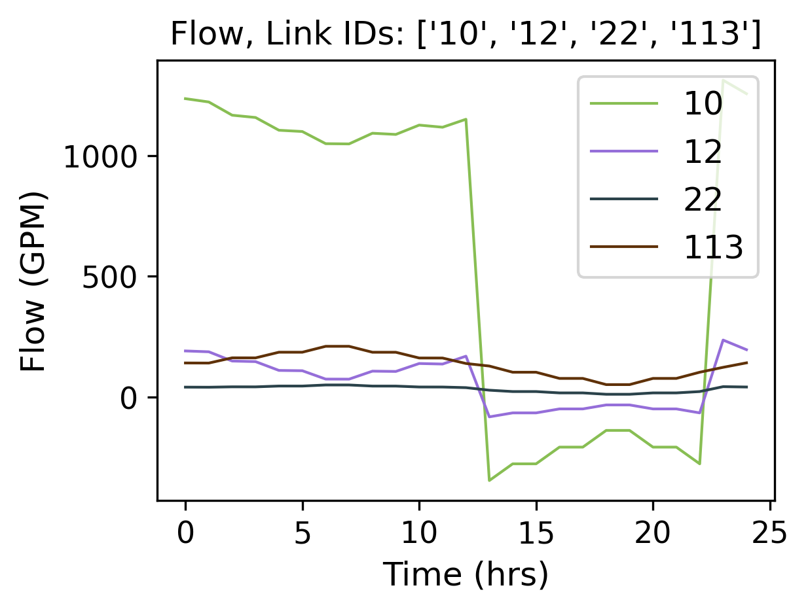
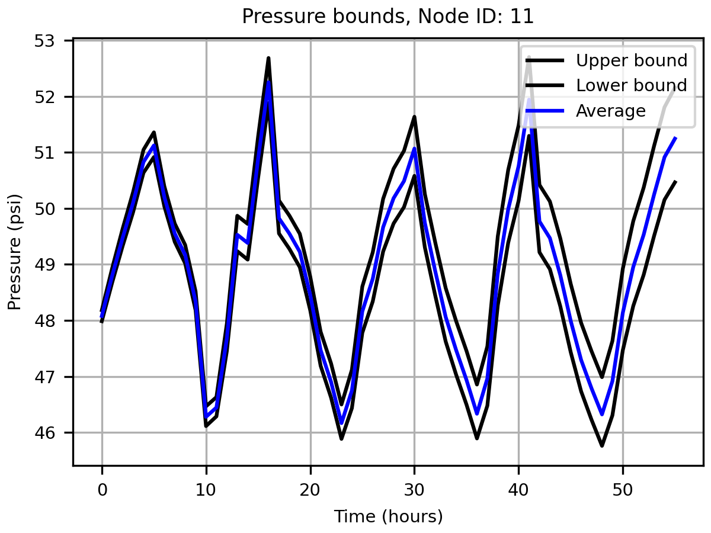

Examples
========

In the following examples, we introduce a selection of the capabilities of the tool and an illustrative smart water research example.

Simple example
--------------

The ``EPyT`` python class, epanet, includes properties of the input network model, static properties, public functions, and local functions that directly call the ``EPANET`` shared object library or the executable. The full API with detailed examples is provided in the link. In the following paragraphs, we introduce a selection of the capabilities of the tool and an illustrative smart water research example.

Through ``EPyT``, users can easily load ``EPANET`` network models, as demonstrated by importing the module and loading the ``Net1.inp`` network in a provided example.

.. code-block:: python

    from epyt import epanet

.. code-block:: python

    # Load EPANET Input File
    G = epanet('Net1.inp')

.. parsed-literal::

    EPANET version 20200 loaded (EPyT version 1.0.5).
    Input File Net1.inp loaded successfully.

In this example, ``G`` is an epanet object which can be defined mathematically as the set comprised of the network graph topology (such as nodes and links), structural parameters (such as pipe lengths, diameters, etc.), and functions (such as hydraulic solvers, etc.). ``G`` can also be shared between different functions as an argument.

When the object is constructed, the module reads the ``EPANET`` input network file and populates more than 500 object parameters. To view some of the parameters and receive assistance with respect to the methods, the user can use the following commands:

.. code-block:: python

    # Lists all available functions and properties
    dir(G)

.. parsed-literal::

    ['BinTempfile',
     'CMDCODE',
     'ControlLevelValues',
     'ControlLinkIndex',
     'ControlNodeIndex',
     'ControlRulesCount',
     'ControlSettings',
     'ControlTypes',
     'ControlTypesIndex',
     'Controls',
     'CurveCount',
     'CurveIndex',
     'CurvesInfo',
     ...]

.. code-block:: python

    # Retrieve some examples for the function
    help(G.getNodeElevations)

.. parsed-literal::

    Help on method getNodeElevations in module epyt.epanet:

    getNodeElevations(*argv) method of epyt.epanet.epanet instance
        Retrieves the value of all node elevations.
        Example:

        >>> d.getNodeElevations()             # Retrieves the value of all node elevations
        >>> d.getNodeElevations(1)            # Retrieves the value of the first node elevation
        >>> d.getNodeElevations([4, 5, 6])    # Retrieves the value of the 5th to 7th node elevations

        See also setNodeElevations, getNodesInfo, getNodeNameID,
        getNodeType, getNodeEmitterCoeff, getNodeInitialQuality.

Using object ``G``, the user can call all the public toolkit functions. The toolkit contains a large set of functions that allow the user to retrieve or update the network data and simulate hydraulic and quality analysis for different scenarios using the ``EPANET`` libraries. Examples of how to retrieve some common network parameter values are provided below:

.. code-block:: python

    # Retrieve Link diameters
    diameters = G.getLinkDiameter()
    print(diameters)

.. parsed-literal::

    [18. 14. 10. 10. 12.  6. 18. 10. 12.  8.  8.  6.  0.]

.. code-block:: python

    # Retrieve Node elevations
    elevations = G.getNodeElevations()
    print(elevations)

Variables diameters and elevations are two arrays, corresponding to the number of links, and the number of nodes in the ``Net1`` network, respectively. Note that, in case the network model changes, these parameters will be updated. This is demonstrated in the following example:

.. parsed-literal::

    [710. 710. 700. 695. 700. 695. 690. 700. 710. 800. 850.]

To modify some parameters, we can use the ``set`` commands.

.. code-block:: python

    # Link diameter for links 2 & 10
    diameters = G.getLinkDiameter([2, 10])
    print(diameters)

.. parsed-literal::

    [14.  8.]

.. code-block:: python

    # Update the link 10 diameter from 100 to 90
    G.setLinkDiameter(10, 90)
    # Retrieve the diameter of link 10
    n_diameter = G.getLinkDiameter(10)
    print(n_diameter)

.. parsed-literal::

    90.0

Next, we show how to simulate the water distribution network, such as flows/pressures and water quality. Various functions have been included in the toolkit to simplify the workflows of solving and retrieving the data from the library memory. One way is to solve the hydraulics and quality equations using the ``EPANET`` library and store the results in data structures.

.. code-block:: python

    # Solve hydraulics in library
    # H = G.getComputedHydraulicTimeSeries()
    # Solve quality dynamics in library
    # Q = G.getComputedQualityTimeSeries()
    # Solve all dynamics in library, create a binary file to store the computed values
    R = G.getComputedTimeSeries()

To access the different values, the user can use the dot notation, such as ``R.Flow`` to create an array with the flows and ``R.NodeQuality`` for the water quality at the nodes. It is important to note that the time intervals may be different for the hydraulic and quality time series, due to the simulation settings; the user can call ``R.Time``, to retrieve the time in seconds.

Executing the functions ``G.plot()`` or ``G.plot_ts()``, a figure of the network along with its components is displayed. The nodes i.e., junctions, reservoirs, tanks, and the links, i.e., pipes, valves, and pumps, are depicted using different colors and shapes. An example is provided below:

.. code-block:: python

    # Plot link flows and quality
    hrs_time = R.Time / 3600
    link_indices = [1, 3, 5, 10]
    link_names = G.getLinkNameID(link_indices)
    G.plot_ts(X=hrs_time, Y=R.Flow[:, link_indices],
              title=f'Flow, Link IDs: {link_names}', figure_size=[4, 3], legend_location='best',
              xlabel='Time (hrs)', ylabel=f'Flow ({G.units.LinkFlowUnits})',
              marker=None, labels=link_names, save_fig=True, filename='figures/paper_flows')
    G.plot_ts(X=hrs_time, Y=R.LinkQuality[:, link_indices],
              title=f'Quality, Link IDs: {link_names}', legend_location='best',
              xlabel='Time (hrs)', ylabel=f'Quality', figure_size=[4, 3],
              marker=None, labels=link_names, save_fig=True, filename='figures/paper_link_quality')

    # Plot node pressures and quality
    node_indices = [2, 4, 6, 10]
    node_names = G.getNodeNameID(node_indices)
    G.plot_ts(X=hrs_time, Y=R.Pressure[:, node_indices], legend_location='best',
              title=f'Pressure, Node IDs: {node_names}', figure_size=[4, 3],
              xlabel='Time (hrs)', ylabel=f'Pressure ({G.units.NodePressureUnits})',
              marker=None, labels=node_names, save_fig=True, filename='figures/paper_pressures')

    G.plot_ts(X=hrs_time, Y=R.NodeQuality[:, node_indices],
              title=f'Quality, Node IDs: {node_names}', legend_location='best',
              xlabel='Time (hrs)', ylabel=f'Quality', figure_size=[4, 3],
              marker=None, labels=node_names, save_fig=True, filename='figures/paper_node_quality')

.. image:: _static/joss_simple_example_9_1.png
   :alt: joss_simple_example_9_1
   :align: center

.. image:: _static/joss_simple_example_9_2.png
   :alt: joss_simple_example_9_2
   :align: center

.. image:: _static/joss_simple_example_9_3.png
   :alt: joss_simple_example_9_3
   :align: center

Advanced example
---------------
A more advanced example is provided below, for designing a simple leakage detection algorithm for the Net2 benchmark network. The goal is to generate pressure bounds (i.e., the adaptive upper and lower levels of pressure expected at a node, given the uncertainty in model parameters) which can be used to detect events in the system, e.g., by comparing them with available pressure sensor measurements.

.. code-block:: python

    from epyt import epanet
    import matplotlib.pyplot as plt
    import numpy as np

.. code-block:: python

    # Create a function to run the simulation and return the pressure results
    def compute_bounds(G, nsim, base_demands, eta_bar, node_index):
        # Seed number to always get the same random results
        np.random.seed(1)
        # Initialize matrix to save MCS pressures
        pmcs = [None for _ in range(nsim)]
        for i in range(nsim):
            # Compute new base demands
            delta_bd = (2 * np.random.rand(1, len(base_demands))[0] - 1) * eta_bar * base_demands
            new_base_demands = base_demands + delta_bd
            # Set base demands
            G.setNodeBaseDemands(new_base_demands)
            # Compute pressures at each node
            pmcs[i] = G.getComputedHydraulicTimeSeries().Pressure
            print(f"Epoch {i}")

        # Compute upper and lower bounds
        pmulti = []
        for i in range(nsim):
            pmulti.append(pmcs[i][:, node_index - 1])
        pmulti = np.vstack(pmulti)
        ub = np.max(pmulti, axis=0)
        lb = np.min(pmulti, axis=0)
        meanb = np.mean(pmulti, axis=0)

        return pmulti, ub, lb, meanb

For generating leakage events, it's useful to activate the Pressure-Driven Analysis (PDA), instead of using the default Demand-Driven Analysis (DDA), as the effect on demands due to pressure drops during leakages is not negligible. Moreover, PDA avoids simulation errors due to negative pressures.

.. code-block:: python

    def activate_PDA(G):
        type = 'PDA'
        pmin = 0
        preq = 0.1
        pexp = 0.5
        G.setDemandModel(type, pmin, preq, pexp)  # Sets the demand model

.. code-block:: python

    if __name__ == "__main__":

        # Prepare network for Monte Carlo Simulations
        # Load network
        inp_name = 'Net2.inp'  # 'L-TOWN.inp'
        G = epanet(inp_name)
        # Pressure driven analysis
        activate_PDA(G)

.. parsed-literal::

    EPANET version 20200 loaded (EPyT version 1.0.5).
    Input File Net2.inp loaded successfully.

.. code-block:: python

        # Get nominal base demands
        base_demands = G.getNodeBaseDemands()[1]
        print(base_demands)

.. parsed-literal::

    [-694.4     8.     14.      8.      8.      5.      4.      9.     14.
        5.     34.78   16.      2.      2.      2.     20.     20.     20.
        5.     19.     16.     10.      8.     11.      6.      8.      0.
        7.      3.     17.     17.      1.5     1.5     0.      1.      0.  ]

We assume we have a pressure sensor at the node with ID "11". We will now create the pressure bounds at that node, using Monte Carlo Simulations (MCS). We assume that there is 2% uncertainty in the nominal base demands compared to the actual demand, which is evenly distributed with the nominal value as the mean. We consider a suitable number of
MCS (we use 100 epochs for computational convenience, however, more simulations would provide a more accurate estimation of the bounds). Starting from the current time, we run the simulations for 56 hours for each randomized scenario, the computed pressure measurements are recorded.

.. code-block:: python

        # Number of simulations
        nsim = 100
        # Pressure Simulations at Node 5
        node_id = '11'
        node_index = G.getNodeIndex(node_id)
        # 5% max uncertainty in base demands
        eta_bar = 0.02
        pmulti, ub, lb, meanb = compute_bounds(G, nsim, base_demands, eta_bar, node_index)
        print(pmulti, ub, lb, meanb)

.. parsed-literal::

    Epoch 0
    Epoch 1
    Epoch 2
    Epoch 3
    Epoch 4
    ...

The upper and lower bounds can be computed by processing all the simulated pressure measurements using numpy methods. The results are depicted in Figure 3. Given a sufficient number of simulations, we expect that under normal conditions, pressure at node "11" will reside between those bounds. In blue, the average pressure computed by the MCS is depicted.

.. code-block:: python

        # Plots
        pressure_units = G.units.NodePressureUnits
        fig, ax = plt.subplots(figsize=(4, 3))
        ax.plot(ub, 'k')
        ax.plot(lb, 'k')
        ax.plot(meanb, 'b')
        ax.grid(True)
        ax.legend(['Upper bound', 'Lower bound', 'Average'], loc='upper right')
        ax.set_title(f'Pressure bounds, Node ID: {node_id}')
        ax.set_xlabel('Time (hours)')
        ax.set_ylabel(f'Pressure ({pressure_units})')
        plt.show()
        fig.savefig('figures/paper_pressure_bounds.png', dpi=300)

To demonstrate the detection ability of the proposed approach, we simulate a leakage with 50 gallons per minute (GPM) outflow at the node with ID "7", starting 20 hours after the current time. During a leakage event, we expect that the pressure will drop, and for a sufficiently large leak, the measured pressure can fall below the estimated lower bound, thus triggering a leakage warning.

.. code-block:: python

        # Add leakage at Node ID 7 after 20 hours
        leak_scenario = 50
        leak_start = 20
        leak_value = 50  # GPM unit
        leak_node_id = '7'
        leak_node_index = G.getNodeIndex(leak_node_id)
        leak_pattern = np.zeros(max(G.getPatternLengths()))
        leak_pattern[leak_start:] = 1
        pattern_index = G.addPattern('leak', leak_pattern)
        G.setNodeDemandPatternIndex(leak_node_index, pattern_index)
        G.setNodeBaseDemands(leak_node_index, leak_value)

.. code-block:: python

        # Compute pressures
        scada_pressures = G.getComputedHydraulicTimeSeries().Pressure

The detection algorithm compares the lower pressure bound of node '7' with the actual pressure as follows:

.. code-block:: python

        p7 = scada_pressures[:, node_index-1]
        e = p7 - lb
        alert = e < 0
        detectionTime = np.argmax(alert>1)

.. code-block:: python

        # Bounds with Leakage
        fig, ax = plt.subplots(figsize=(4, 3))
        ax.plot(ub, 'k')
        ax.plot(lb, 'k')
        ax.plot(p7, 'r')
        ax.grid(True)
        ax.legend(['Upper bound', 'Lower bound', 'Sensor'], loc='upper right')
        ax.set_title(f'Pressure bounds, Leak Node ID: {leak_node_id}')
        ax.set_xlabel('Time (hours)')
        ax.set_ylabel(f'Pressure ({pressure_units})')
        plt.show()
        fig.savefig('figures/paper_pressure_bounds_leak.png', dpi=300)

.. image:: _static/joss_advance_example_10_0.png
   :alt: joss_advance_example_10_0
   :align: center

We observe that in this use case, until time 27 hours, the sensor measurement was within the upper and lower bounds computed in the previous step, therefore there was a 7 hour delay in detecting the leakage.

.. code-block:: python

        # Leakage alert
        fig, ax = plt.subplots(figsize=(4, 3))
        ax.plot(alert)
        ax.set_title(f'Leakage alert')
        ax.set_xlabel('Time (hours)')
        plt.show()
        fig.savefig('figures/paper_leakage_alert.png', dpi=300)

.. image:: _static/joss_advance_example_11_0.png
   :alt: joss_advance_example_11_0
   :align: center
