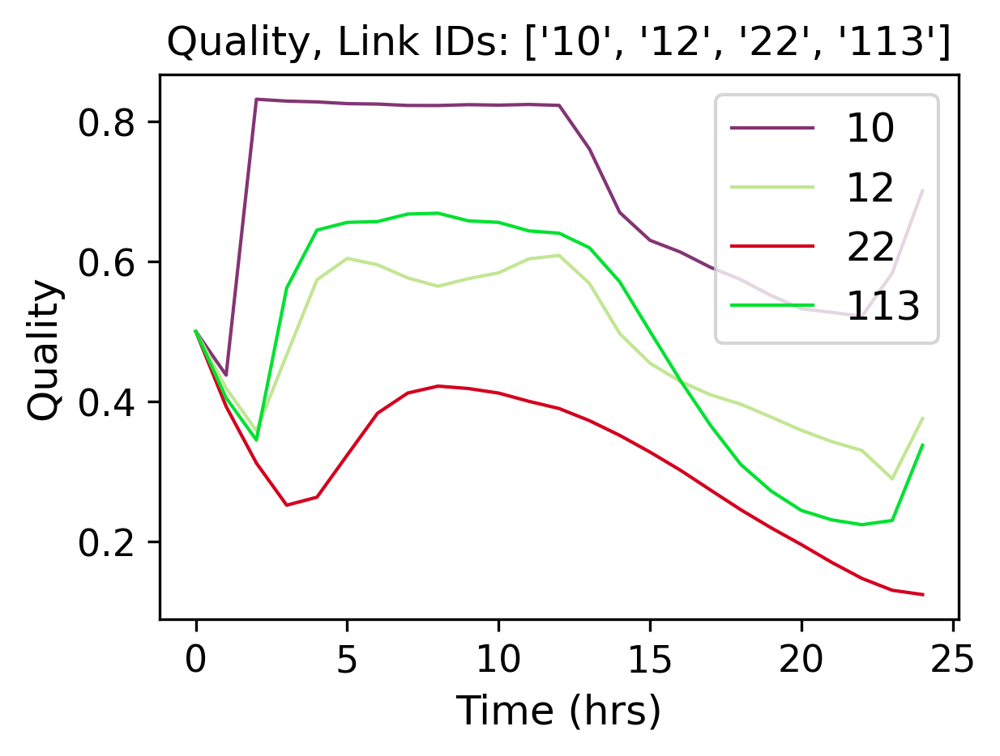
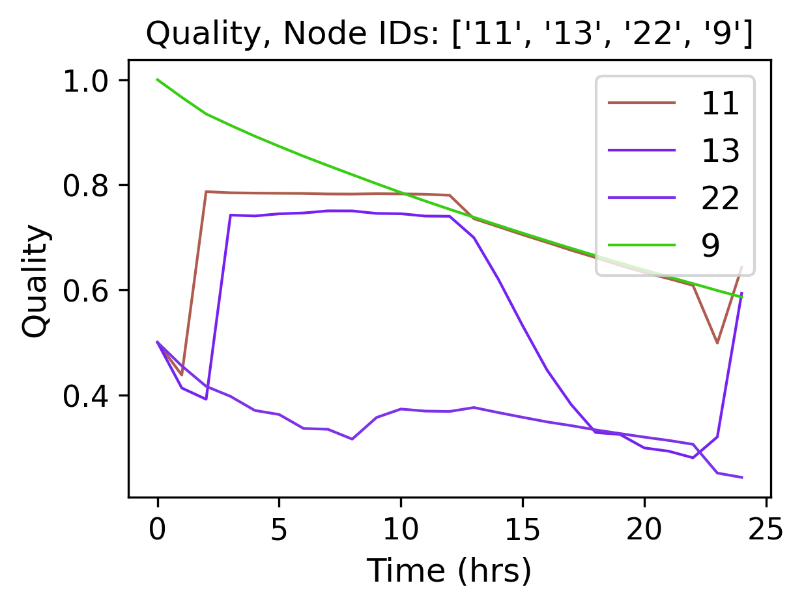
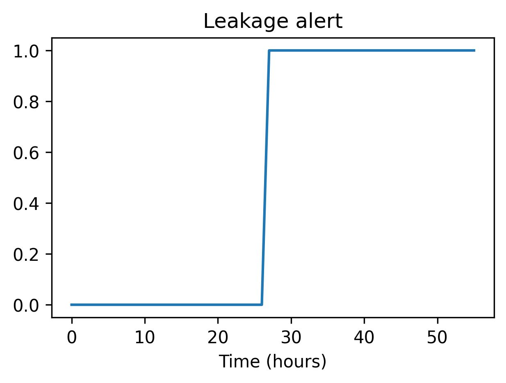

Examples
========

In the following examples, we introduce a selection of the capabilities of the tool and an illustrative smart water research example.

Simple example
--------------

.. code-block:: python

    from epyt import epanet

.. code-block:: python

    # Load EPANET Input File
    G = epanet('Net1.inp')

.. parsed-literal::

    EPANET version 20200 loaded (EPyT version 1.0.5).
    Input File Net1.inp loaded successfully.

.. code-block:: python

    # Lists all available functions and properties
    dir(G)

.. parsed-literal::

    ['BinTempfile',
     'CMDCODE',
     'ControlLevelValues',
     'ControlLinkIndex',
     'ControlNodeIndex',
     'ControlRulesCount',
     'ControlSettings',
     'ControlTypes',
     'ControlTypesIndex',
     'Controls',
     'CurveCount',
     'CurveIndex',
     'CurvesInfo',
     'DEMANDMODEL',
     'InputFile',
     'Iterations',
     'LOGOP',
     'LibEPANET',
     'LibEPANETpath',
     'LinkBulkReactionCoeff',
     'LinkCount',
     'LinkDiameter',
     'LinkFlowUnits',
     'LinkIndex',
     'LinkInitialSetting',
     'LinkInitialStatus',
     'LinkLength',
     'LinkMinorLossCoeff',
     'LinkNameID',
     'LinkPipeCount',
     'LinkPipeIndex',
     'LinkPipeNameID',
     'LinkPumpCount',
     'LinkPumpHeadCurveIndex',
     'LinkPumpIndex',
     'LinkPumpNameID',
     'LinkPumpPatternIndex',
     'LinkPumpPatternNameID',
     'LinkPumpPower',
     'LinkPumpType',
     'LinkPumpTypeCode',
     'LinkRoughnessCoeff',
     'LinkType',
     'LinkTypeIndex',
     'LinkValveCount',
     'LinkValveIndex',
     'LinkValveNameID',
     'LinkWallReactionCoeff',
     'NodeBaseDemands',
     'NodeCoordinates',
     'NodeCount',
     'NodeDemandCategoriesNumber',
     'NodeDemandPatternIndex',
     'NodeDemandPatternNameID',
     'NodeElevations',
     'NodeEmitterCoeff',
     'NodeIndex',
     'NodeInitialQuality',
     'NodeJunctionCount',
     'NodeJunctionIndex',
     'NodeJunctionNameID',
     'NodeNameID',
     'NodePatternIndex',
     'NodeReservoirCount',
     'NodeReservoirIndex',
     'NodeReservoirNameID',
     'NodeSourcePatternIndex',
     'NodeSourceQuality',
     'NodeSourceTypeIndex',
     'NodeTankBulkReactionCoeff',
     'NodeTankCount',
     'NodeTankDiameter',
     'NodeTankIndex',
     'NodeTankInitialLevel',
     'NodeTankInitialWaterVolume',
     'NodeTankMaximumWaterLevel',
     'NodeTankMaximumWaterVolume',
     'NodeTankMinimumFraction',
     'NodeTankMinimumWaterLevel',
     'NodeTankMinimumWaterVolume',
     'NodeTankMixZoneVolume',
     'NodeTankMixingModelCode',
     'NodeTankMixingModelType',
     'NodeTankNameID',
     'NodeTankReservoirCount',
     'NodeTankVolumeCurveIndex',
     'NodeType',
     'NodeTypeIndex',
     'NodesConnectingLinksID',
     'NodesConnectingLinksIndex',
     'OptionsAccuracyValue',
     'OptionsEmitterExponent',
     'OptionsFlowChange',
     'OptionsHeadError',
     'OptionsHeadLossFormula',
     'OptionsHydraulics',
     'OptionsMaxTrials',
     'OptionsPattern',
     'OptionsPatternDemandMultiplier',
     'OptionsQualityTolerance',
     'OptionsSpecificGravity',
     'OptionsUnbalanced',
     'OptionsViscosity',
     'Pattern',
     'PatternAverageValue',
     'PatternCount',
     'PatternIndex',
     'PatternLengths',
     'PatternNameID',
     'QualityChemName',
     'QualityChemUnits',
     'QualityCode',
     'QualityTraceNodeIndex',
     'QualityType',
     'RULEOBJECT',
     'RULEOPERATOR',
     'RULESTATUS',
     'RULEVARIABLE',
     'RelativeError',
     'RptTempfile',
     'TYPEBINSTATUS',
     'TYPECONTROL',
     'TYPECURVE',
     'TYPEHEADLOSS',
     'TYPELINK',
     'TYPEMIXMODEL',
     'TYPENODE',
     'TYPEPUMP',
     'TYPEPUMPSTATE',
     'TYPEQUALITY',
     'TYPEREPORT',
     'TYPESOURCE',
     'TYPESTATS',
     'TYPESTATUS',
     'TYPEUNITS',
     'TempInpFile',
     'TimeHTime',
     'TimeHaltFlag',
     'TimeHydraulicStep',
     'TimeNextEvent',
     'TimePatternStart',
     'TimePatternStep',
     'TimeQualityStep',
     'TimeReportingPeriods',
     'TimeReportingStart',
     'TimeReportingStep',
     'TimeRuleControlStep',
     'TimeSimulationDuration',
     'TimeStartTime',
     'TimeStatisticsIndex',
     'TimeStatisticsType',
     'ToolkitConstants',
     'Version',
     '__class__',
     '__delattr__',
     '__dict__',
     '__dir__',
     '__doc__',
     '__eq__',
     '__format__',
     '__ge__',
     '__getattribute__',
     '__gt__',
     '__hash__',
     '__init__',
     '__init_subclass__',
     '__le__',
     '__lt__',
     '__module__',
     '__ne__',
     '__new__',
     '__reduce__',
     '__reduce_ex__',
     '__repr__',
     '__setattr__',
     '__sizeof__',
     '__str__',
     '__subclasshook__',
     '__weakref__',
     '_epanet__addComment',
     '_epanet__addControlFunction',
     '_epanet__changeNodeType',
     '_epanet__checkLinkIfString',
     '_epanet__controlSettings',
     '_epanet__createTempfiles',
     '_epanet__exist_inp_file',
     '_epanet__getControlIndices',
     '_epanet__getCurveIndices',
     '_epanet__getInitParams',
     '_epanet__getLinkIndices',
     '_epanet__getLinkInfo',
     '_epanet__getNodeIndices',
     '_epanet__getNodeInfo',
     '_epanet__getNodeJunctionIndices',
     '_epanet__getNodeTankMixiningModel',
     '_epanet__getPumpLinkInfo',
     '_epanet__getTankNodeInfo',
     '_epanet__isMember',
     '_epanet__readEpanetBin',
     '_epanet__returnValue',
     '_epanet__setControlFunction',
     '_epanet__setEval',
     '_epanet__setEvalLinkNode',
     '_epanet__setFlowUnits',
     '_epanet__setNodeDemandPattern',
     'addControls',
     'addCurve',
     'addLinkPipe',
     'addLinkPipeCV',
     'addLinkPump',
     'addLinkValveFCV',
     'addLinkValveGPV',
     'addLinkValvePBV',
     'addLinkValvePRV',
     'addLinkValvePSV',
     'addLinkValveTCV',
     'addNodeJunction',
     'addNodeJunctionDemand',
     'addNodeReservoir',
     'addNodeTank',
     'addPattern',
     'addRules',
     'api',
     'appRotateNetwork',
     'appShiftNetwork',
     'arange',
     'classversion',
     'clearReport',
     'closeHydraulicAnalysis',
     'closeNetwork',
     'closeQualityAnalysis',
     'copyReport',
     'createProject',
     'deleteAllTemps',
     'deleteControls',
     'deleteCurve',
     'deleteLink',
     'deleteNode',
     'deleteNodeJunctionDemand',
     'deletePattern',
     'deletePatternsAll',
     'deleteProject',
     'deleteRules',
     'demModelInfo',
     'getAdjacencyMatrix',
     'getCMDCODE',
     'getComputedHydraulicTimeSeries',
     'getComputedQualityTimeSeries',
     'getComputedTimeSeries',
     'getComputedTimeSeries_ENepanet',
     'getConnectivityMatrix',
     'getControlRulesCount',
     'getControls',
     'getCounts',
     'getCurveComment',
     'getCurveCount',
     'getCurveIndex',
     'getCurveLengths',
     'getCurveNameID',
     'getCurveType',
     'getCurveTypeIndex',
     'getCurveValue',
     'getCurvesInfo',
     'getDemandModel',
     'getENfunctionsImpemented',
     'getError',
     'getFlowUnits',
     'getLibFunctions',
     'getLinkActualQuality',
     'getLinkBulkReactionCoeff',
     'getLinkComment',
     'getLinkCount',
     'getLinkDiameter',
     'getLinkEnergy',
     'getLinkFlows',
     'getLinkHeadloss',
     'getLinkIndex',
     'getLinkInitialSetting',
     'getLinkInitialStatus',
     'getLinkLength',
     'getLinkMinorLossCoeff',
     'getLinkNameID',
     'getLinkNodesIndex',
     'getLinkPipeCount',
     'getLinkPipeIndex',
     'getLinkPipeNameID',
     'getLinkPumpCount',
     'getLinkPumpECost',
     'getLinkPumpECurve',
     'getLinkPumpEPat',
     'getLinkPumpEfficiency',
     'getLinkPumpHCurve',
     'getLinkPumpHeadCurveIndex',
     'getLinkPumpIndex',
     'getLinkPumpNameID',
     'getLinkPumpPatternIndex',
     'getLinkPumpPatternNameID',
     'getLinkPumpPower',
     'getLinkPumpState',
     'getLinkPumpSwitches',
     'getLinkPumpType',
     'getLinkPumpTypeCode',
     'getLinkQuality',
     'getLinkResultIndex',
     'getLinkRoughnessCoeff',
     'getLinkSettings',
     'getLinkStatus',
     'getLinkType',
     'getLinkTypeIndex',
     'getLinkValveCount',
     'getLinkValveIndex',
     'getLinkValveNameID',
     'getLinkVelocity',
     'getLinkVertices',
     'getLinkVerticesCount',
     'getLinkWallReactionCoeff',
     'getLinksInfo',
     'getNetworksDatabase',
     'getNodeActualDemand',
     'getNodeActualDemandSensingNodes',
     'getNodeActualQuality',
     'getNodeActualQualitySensingNodes',
     'getNodeBaseDemands',
     'getNodeComment',
     'getNodeCoordinates',
     'getNodeCount',
     'getNodeDemandCategoriesNumber',
     'getNodeDemandDeficit',
     'getNodeDemandPatternIndex',
     'getNodeDemandPatternNameID',
     'getNodeElevations',
     'getNodeEmitterCoeff',
     'getNodeHydraulicHead',
     'getNodeIndex',
     'getNodeInitialQuality',
     'getNodeJunctionCount',
     'getNodeJunctionDemandIndex',
     'getNodeJunctionDemandName',
     'getNodeJunctionIndex',
     'getNodeJunctionNameID',
     'getNodeMassFlowRate',
     'getNodeNameID',
     'getNodePatternIndex',
     'getNodePressure',
     'getNodeReservoirCount',
     'getNodeReservoirIndex',
     'getNodeReservoirNameID',
     'getNodeResultIndex',
     'getNodeSourcePatternIndex',
     'getNodeSourceQuality',
     'getNodeSourceType',
     'getNodeSourceTypeIndex',
     'getNodeTankBulkReactionCoeff',
     'getNodeTankCanOverFlow',
     'getNodeTankCount',
     'getNodeTankData',
     'getNodeTankDiameter',
     'getNodeTankIndex',
     'getNodeTankInitialLevel',
     'getNodeTankInitialWaterVolume',
     'getNodeTankMaximumWaterLevel',
     'getNodeTankMaximumWaterVolume',
     'getNodeTankMinimumWaterLevel',
     'getNodeTankMinimumWaterVolume',
     'getNodeTankMixZoneVolume',
     'getNodeTankMixingFraction',
     'getNodeTankMixingModelCode',
     'getNodeTankMixingModelType',
     'getNodeTankNameID',
     'getNodeTankReservoirCount',
     'getNodeTankVolume',
     'getNodeTankVolumeCurveIndex',
     'getNodeType',
     'getNodeTypeIndex',
     'getNodesConnectingLinksID',
     'getNodesConnectingLinksIndex',
     'getNodesInfo',
     'getOptionsAccuracyValue',
     'getOptionsCheckFrequency',
     'getOptionsDampLimit',
     'getOptionsDemandCharge',
     'getOptionsEmitterExponent',
     'getOptionsExtraTrials',
     'getOptionsFlowChange',
     'getOptionsGlobalEffic',
     'getOptionsGlobalPattern',
     'getOptionsGlobalPrice',
     'getOptionsHeadError',
     'getOptionsHeadLossFormula',
     'getOptionsLimitingConcentration',
     'getOptionsMaxTrials',
     'getOptionsMaximumCheck',
     'getOptionsPatternDemandMultiplier',
     'getOptionsPipeBulkReactionOrder',
     'getOptionsPipeWallReactionOrder',
     'getOptionsQualityTolerance',
     'getOptionsSpecificDiffusivity',
     'getOptionsSpecificGravity',
     'getOptionsSpecificViscosity',
     'getOptionsTankBulkReactionOrder',
     'getPattern',
     'getPatternAverageValue',
     'getPatternComment',
     'getPatternCount',
     'getPatternIndex',
     'getPatternLengths',
     'getPatternNameID',
     'getPatternValue',
     'getQualityCode',
     'getQualityInfo',
     'getQualityTraceNodeIndex',
     'getQualityType',
     'getRuleCount',
     'getRuleID',
     'getRuleInfo',
     'getRules',
     'getStatistic',
     'getTimeHTime',
     'getTimeHaltFlag',
     'getTimeHydraulicStep',
     'getTimeNextEvent',
     'getTimeNextEventTank',
     'getTimePatternStart',
     'getTimePatternStep',
     'getTimeQTime',
     'getTimeQualityStep',
     'getTimeReportingPeriods',
     'getTimeReportingStart',
     'getTimeReportingStep',
     'getTimeRuleControlStep',
     'getTimeSimulationDuration',
     'getTimeStartTime',
     'getTimeStatisticsIndex',
     'getTimeStatisticsType',
     'getTitle',
     'getUnits',
     'getVersion',
     'initializeEPANET',
     'initializeHydraulicAnalysis',
     'initializeQualityAnalysis',
     'libFunctions',
     'linkInfo',
     'loadEPANETFile',
     'max',
     'min',
     'multiply_elements',
     'netName',
     'nextHydraulicAnalysisStep',
     'nextQualityAnalysisStep',
     'nodeInfo',
     'openAnyInp',
     'openCurrentInp',
     'openHydraulicAnalysis',
     'openQualityAnalysis',
     'plot',
     'plot_close',
     'plot_save',
     'plot_show',
     'plot_ts',
     'printv',
     'qual',
     'reloadNetwork',
     'runEPANETexe',
     'runHydraulicAnalysis',
     'runQualityAnalysis',
     'runsCompleteSimulation',
     'saveHydraulicFile',
     'saveHydraulicsOutputReportingFile',
     'saveInputFile',
     'setCMDCODE',
     'setControls',
     'setCurve',
     'setCurveComment',
     'setCurveNameID',
     'setCurveValue',
     'setDemandModel',
     'setFlowUnitsAFD',
     'setFlowUnitsCFS',
     'setFlowUnitsCMD',
     'setFlowUnitsCMH',
     'setFlowUnitsGPM',
     'setFlowUnitsIMGD',
     'setFlowUnitsLPM',
     'setFlowUnitsLPS',
     'setFlowUnitsMGD',
     'setFlowUnitsMLD',
     'setLinkBulkReactionCoeff',
     'setLinkComment',
     'setLinkDiameter',
     'setLinkInitialSetting',
     'setLinkInitialStatus',
     'setLinkLength',
     'setLinkMinorLossCoeff',
     'setLinkNameID',
     'setLinkNodesIndex',
     'setLinkPipeData',
     'setLinkPumpECost',
     'setLinkPumpECurve',
     'setLinkPumpEPat',
     'setLinkPumpHCurve',
     'setLinkPumpHeadCurveIndex',
     'setLinkPumpPatternIndex',
     'setLinkPumpPower',
     'setLinkRoughnessCoeff',
     'setLinkSettings',
     'setLinkStatus',
     'setLinkTypePipe',
     'setLinkTypePipeCV',
     'setLinkTypePump',
     'setLinkTypeValveFCV',
     'setLinkTypeValveGPV',
     'setLinkTypeValvePBV',
     'setLinkTypeValvePRV',
     'setLinkTypeValvePSV',
     'setLinkTypeValveTCV',
     'setLinkVertices',
     'setLinkWallReactionCoeff',
     'setNodeBaseDemands',
     'setNodeComment',
     'setNodeCoordinates',
     'setNodeDemandPatternIndex',
     'setNodeElevations',
     'setNodeEmitterCoeff',
     'setNodeInitialQuality',
     'setNodeJunctionData',
     'setNodeJunctionDemandName',
     'setNodeNameID',
     'setNodeSourcePatternIndex',
     'setNodeSourceQuality',
     'setNodeSourceType',
     'setNodeTankBulkReactionCoeff',
     'setNodeTankCanOverFlow',
     'setNodeTankData',
     'setNodeTankDiameter',
     'setNodeTankInitialLevel',
     'setNodeTankMaximumWaterLevel',
     'setNodeTankMinimumWaterLevel',
     'setNodeTankMinimumWaterVolume',
     'setNodeTankMixingFraction',
     'setNodeTankMixingModelType',
     'setNodeTypeJunction',
     'setNodeTypeReservoir',
     'setNodeTypeTank',
     'setNodesConnectingLinksID',
     'setOptionsAccuracyValue',
     'setOptionsCheckFrequency',
     'setOptionsDampLimit',
     'setOptionsDemandCharge',
     'setOptionsEmitterExponent',
     'setOptionsExtraTrials',
     'setOptionsFlowChange',
     'setOptionsGlobalEffic',
     'setOptionsGlobalPattern',
     'setOptionsGlobalPrice',
     'setOptionsHeadError',
     'setOptionsHeadLossFormula',
     'setOptionsLimitingConcentration',
     'setOptionsMaxTrials',
     'setOptionsMaximumCheck',
     'setOptionsPatternDemandMultiplier',
     'setOptionsPipeBulkReactionOrder',
     'setOptionsPipeWallReactionOrder',
     'setOptionsQualityTolerance',
     'setOptionsSpecificDiffusivity',
     'setOptionsSpecificGravity',
     'setOptionsSpecificViscosity',
     'setOptionsTankBulkReactionOrder',
     'setPattern',
     'setPatternComment',
     'setPatternMatrix',
     'setPatternNameID',
     'setPatternValue',
     'setQualityType',
     'setReport',
     'setReportFormatReset',
     'setReportStatus',
     'setRuleElseAction',
     'setRulePremise',
     'setRulePremiseObjectNameID',
     'setRulePremiseStatus',
     'setRulePremiseValue',
     'setRulePriority',
     'setRuleThenAction',
     'setRules',
     'setTimeHydraulicStep',
     'setTimePatternStart',
     'setTimePatternStep',
     'setTimeQualityStep',
     'setTimeReportingStart',
     'setTimeReportingStep',
     'setTimeRuleControlStep',
     'setTimeSimulationDuration',
     'setTimeStatisticsType',
     'setTitle',
     'solveCompleteHydraulics',
     'solveCompleteQuality',
     'splitPipe',
     'stepQualityAnalysisTimeLeft',
     'to_array',
     'to_mat',
     'units',
     'unload',
     'useHydraulicFile',
     'writeLineInReportFile',
     'writeReport']

.. code-block:: python

    # Retrieve some examples for the function
    help(G.getNodeElevations)

.. parsed-literal::

    Help on method getNodeElevations in module epyt.epanet:

    getNodeElevations(*argv) method of epyt.epanet.epanet instance
        Retrieves the value of all node elevations.
        Example:

        >>> d.getNodeElevations()             # Retrieves the value of all node elevations
        >>> d.getNodeElevations(1)            # Retrieves the value of the first node elevation
        >>> d.getNodeElevations([4, 5, 6])    # Retrieves the value of the 5th to 7th node elevations

        See also setNodeElevations, getNodesInfo, getNodeNameID,
        getNodeType, getNodeEmitterCoeff, getNodeInitialQuality.

.. code-block:: python

    # Retrieve Link diameters
    diameters = G.getLinkDiameter()
    print(diameters)

.. parsed-literal::

    [18. 14. 10. 10. 12.  6. 18. 10. 12.  8.  8.  6.  0.]

.. code-block:: python

    # Retrieve Node elevations
    elevations = G.getNodeElevations()
    print(elevations)

.. parsed-literal::

    [710. 710. 700. 695. 700. 695. 690. 700. 710. 800. 850.]

.. code-block:: python

    # Link diameter for links 2 & 10
    diameters = G.getLinkDiameter([2, 10])
    print(diameters)

.. parsed-literal::

    [14.  8.]

.. code-block:: python

    # Update the link 10 diameter from 100 to 90
    G.setLinkDiameter(10, 90)
    # Retrieve the diameter of link 10
    n_diameter = G.getLinkDiameter(10)
    print(n_diameter)

.. parsed-literal::

    90.0

.. code-block:: python

    # Solve hydraulics in library
    # H = G.getComputedHydraulicTimeSeries()
    # Solve quality dynamics in library
    # Q = G.getComputedQualityTimeSeries()
    # Solve all dynamics in library, create a binary file to store the computed values
    R = G.getComputedTimeSeries()

.. code-block:: python

    # Plot link flows and quality
    hrs_time = R.Time / 3600
    link_indices = [1, 3, 5, 10]
    link_names = G.getLinkNameID(link_indices)
    G.plot_ts(X=hrs_time, Y=R.Flow[:, link_indices],
              title=f'Flow, Link IDs: {link_names}', figure_size=[4, 3], legend_location='best',
              xlabel='Time (hrs)', ylabel=f'Flow ({G.units.LinkFlowUnits})',
              marker=None, labels=link_names, save_fig=True, filename='figures/paper_flows')
    G.plot_ts(X=hrs_time, Y=R.LinkQuality[:, link_indices],
              title=f'Quality, Link IDs: {link_names}', legend_location='best',
              xlabel='Time (hrs)', ylabel=f'Quality', figure_size=[4, 3],
              marker=None, labels=link_names, save_fig=True, filename='figures/paper_link_quality')

    # Plot node pressures and quality
    node_indices = [2, 4, 6, 10]
    node_names = G.getNodeNameID(node_indices)
    G.plot_ts(X=hrs_time, Y=R.Pressure[:, node_indices], legend_location='best',
              title=f'Pressure, Node IDs: {node_names}', figure_size=[4, 3],
              xlabel='Time (hrs)', ylabel=f'Pressure ({G.units.NodePressureUnits})',
              marker=None, labels=node_names, save_fig=True, filename='figures/paper_pressures')

    G.plot_ts(X=hrs_time, Y=R.NodeQuality[:, node_indices],
              title=f'Quality, Node IDs: {node_names}', legend_location='best',
              xlabel='Time (hrs)', ylabel=f'Quality', figure_size=[4, 3],
              marker=None, labels=node_names, save_fig=True, filename='figures/paper_node_quality')

.. image:: _static/joss_simple_example_9_0.png
   :alt: joss_simple_example_9_0
   :align: center

.. image:: _static/joss_simple_example_9_2.png
   :alt: joss_simple_example_9_2
   :align: center

Advance example
---------------

.. code-block:: python

    from epyt import epanet
    import matplotlib.pyplot as plt
    import numpy as np

.. code-block:: python

    # Create a function to run the simulation and return the pressure results
    def compute_bounds(G, nsim, base_demands, eta_bar, node_index):
        # Seed number to always get the same random results
        np.random.seed(1)
        # Initialize matrix to save MCS pressures
        pmcs = [None for _ in range(nsim)]
        for i in range(nsim):
            # Compute new base demands
            delta_bd = (2 * np.random.rand(1, len(base_demands))[0] - 1) * eta_bar * base_demands
            new_base_demands = base_demands + delta_bd
            # Set base demands
            G.setNodeBaseDemands(new_base_demands)
            # Compute pressures at each node
            pmcs[i] = G.getComputedHydraulicTimeSeries().Pressure
            print(f"Epoch {i}")

        # Compute upper and lower bounds
        pmulti = []
        for i in range(nsim):
            pmulti.append(pmcs[i][:, node_index - 1])
        pmulti = np.vstack(pmulti)
        ub = np.max(pmulti, axis=0)
        lb = np.min(pmulti, axis=0)
        meanb = np.mean(pmulti, axis=0)

        return pmulti, ub, lb, meanb

.. code-block:: python

    def activate_PDA(G):
        type = 'PDA'
        pmin = 0
        preq = 0.1
        pexp = 0.5
        G.setDemandModel(type, pmin, preq, pexp)  # Sets the demand model

.. code-block:: python

    if __name__ == "__main__":

        # Prepare network for Monte Carlo Simulations
        # Load network
        inp_name = 'Net2.inp'  # 'L-TOWN.inp'
        G = epanet(inp_name)
        # Pressure driven analysis
        activate_PDA(G)

.. parsed-literal::

    EPANET version 20200 loaded (EPyT version 1.0.5).
    Input File Net2.inp loaded successfully.

.. code-block:: python

        # Get nominal base demands
        base_demands = G.getNodeBaseDemands()[1]
        print(base_demands)

.. parsed-literal::

    [-694.4     8.     14.      8.      8.      5.      4.      9.     14.
        5.     34.78   16.      2.      2.      2.     20.     20.     20.
        5.     19.     16.     10.      8.     11.      6.      8.      0.
        7.      3.     17.     17.      1.5     1.5     0.      1.      0.  ]

.. code-block:: python

        # Number of simulations
        nsim = 100
        # Pressure Simulations at Node 5
        node_id = '11'
        node_index = G.getNodeIndex(node_id)
        # 5% max uncertainty in base demands
        eta_bar = 0.02
        pmulti, ub, lb, meanb = compute_bounds(G, nsim, base_demands, eta_bar, node_index)
        print(pmulti, ub, lb, meanb)

.. parsed-literal::

    Epoch 0
    Epoch 1
    Epoch 2
    Epoch 3
    Epoch 4
    Epoch 5
    Epoch 6
    Epoch 7
    Epoch 8
    Epoch 9
    Epoch 10
    Epoch 11
    Epoch 12
    Epoch 13
    Epoch 14
    Epoch 15
    Epoch 16
    Epoch 17
    Epoch 18
    Epoch 19
    Epoch 20
    Epoch 21
    Epoch 22
    Epoch 23
    Epoch 24
    Epoch 25
    Epoch 26
    Epoch 27
    Epoch 28
    Epoch 29
    Epoch 30
    Epoch 31
    Epoch 32
    Epoch 33
    Epoch 34
    Epoch 35
    Epoch 36
    Epoch 37
    Epoch 38
    Epoch 39
    Epoch 40
    Epoch 41
    Epoch 42
    Epoch 43
    Epoch 44
    Epoch 45
    Epoch 46
    Epoch 47
    Epoch 48
    Epoch 49
    Epoch 50
    Epoch 51
    Epoch 52
    Epoch 53
    Epoch 54
    Epoch 55
    Epoch 56
    Epoch 57
    Epoch 58
    Epoch 59
    Epoch 60
    Epoch 61
    Epoch 62
    Epoch 63
    Epoch 64
    Epoch 65
    Epoch 66
    Epoch 67
    Epoch 68
    Epoch 69
    Epoch 70
    Epoch 71
    Epoch 72
    Epoch 73
    Epoch 74
    Epoch 75
    Epoch 76
    Epoch 77
    Epoch 78
    Epoch 79
    Epoch 80
    Epoch 81
    Epoch 82
    Epoch 83
    Epoch 84
    Epoch 85
    Epoch 86
    Epoch 87
    Epoch 88
    Epoch 89
    Epoch 90
    Epoch 91
    Epoch 92
    Epoch 93
    Epoch 94
    Epoch 95
    Epoch 96
    Epoch 97
    Epoch 98
    Epoch 99
    [[48.0734592  48.79156405 49.46221676 ... 50.20541151 50.8701437
      51.19999367]
     [48.11716984 48.85268765 49.53759239 ... 50.59599423 51.2728271
      51.60938507]
     [48.00485705 48.70304686 49.35584728 ... 49.57789142 50.22697165
      50.53961466]
     ...
     [48.14696463 48.89121714 49.58372182 ... 50.84059439 51.5241057
      51.8671023 ]
     [48.00660125 48.70725708 49.36242035 ... 49.73550698 50.38641714
      50.70254953]
     [48.14811586 48.88944034 49.57998325 ... 50.7966281  51.47873652
      51.82299228]] [48.18142147 48.93450862 49.63635157 50.2868541  51.04489835 51.35588332
     50.39320919 49.72764662 49.34597221 48.51669516 46.46541786 46.63090819
     47.94194743 49.86709311 49.72132076 51.28078848 52.68280252 50.14053645
     49.87036256 49.54517394 48.78260161 47.79685109 47.23172011 46.49836545
     47.11959154 48.60381711 49.21399189 50.17077084 50.70641802 51.02703251
     51.6340384  50.25532841 49.38971479 48.57675332 47.9884064  47.45424101
     46.85481128 47.53784286 49.5004439  50.68572827 51.48216361 52.69976687
     50.41785726 50.12309637 49.46356195 48.65060125 47.95399593 47.44834342
     46.98677592 47.63191004 48.92313167 49.7709848  50.36999129 51.11413578
     51.8056471  52.1544578 ] [47.98487435 48.67843042 49.32734588 49.92941523 50.63426499 50.91463089
     50.03505893 49.40056618 49.01682301 48.18120408 46.11349299 46.2863444
     47.45295718 49.23469025 49.08420675 50.54317967 51.87925159 49.55145907
     49.27661158 48.94918793 48.18091195 47.18871178 46.62185201 45.88429321
     46.43337133 47.77796775 48.33742201 49.23023054 49.72848908 50.02205459
     50.57929632 49.30428576 48.4410384  47.6229488  47.03213349 46.49550169
     45.8926285  46.47835062 48.26828709 49.38581087 50.13704228 51.29271993
     49.21537058 48.91417134 48.25008133 47.43199216 46.7318854  46.22436795
     45.76067433 46.30526155 47.46856934 48.25689923 48.81382433 49.5077433
     50.15320937 50.46346141] [48.07867952 48.80018327 49.47331737 50.09775088 50.82693378 51.12226473
     50.20258315 49.55164901 49.16871453 48.3366716  46.27854087 46.44467616
     47.6798684  49.52774727 49.38142394 50.88458803 52.2502828  49.8221382
     49.54935118 49.22308199 48.45796846 47.46894667 46.9019703  46.16619102
     46.74860914 48.15997754 48.74262312 49.66411377 50.18009139 50.4866091
     51.06658392 49.74174162 48.87663122 48.06097544 47.47069624 46.93477461
     46.33336312 46.96563681 48.83600384 49.98395911 50.75635308 51.94003668
     49.76668871 49.46842923 48.80670346 47.99104786 47.2921463  46.78483861
     46.32175326 46.9151267  48.13778027 48.95295711 49.52953183 50.24646109
     50.91321481 51.24257231]

.. code-block:: python

        # Plots
        pressure_units = G.units.NodePressureUnits
        fig, ax = plt.subplots(figsize=(4, 3))
        ax.plot(ub, 'k')
        ax.plot(lb, 'k')
        ax.plot(meanb, 'b')
        ax.legend(['Upper bound', 'Lower bound', 'Average'], loc='upper right')
        ax.set_title(f'Pressure bounds, Node ID: {node_id}')
        ax.set_xlabel('Time (hours)')
        ax.set_ylabel(f'Pressure ({pressure_units})')
        plt.show()
        fig.savefig('figures/paper_pressure_bounds.png', dpi=300)

.. image:: _static/joss_advance_example_6_0.png
   :alt: joss_advance_example_6_0
   :align: center

.. code-block:: python

        # Add leakage at Node ID 7 after 20 hours
        leak_scenario = 50
        leak_start = 20
        leak_value = 50  # GPM unit
        leak_node_id = '7'
        leak_node_index = G.getNodeIndex(leak_node_id)
        leak_pattern = np.zeros(max(G.getPatternLengths()))
        leak_pattern[leak_start:] = 1
        pattern_index = G.addPattern('leak', leak_pattern)
        G.setNodeDemandPatternIndex(leak_node_index, pattern_index)
        G.setNodeBaseDemands(leak_node_index, leak_value)

.. code-block:: python

        # Compute pressures
        scada_pressures = G.getComputedHydraulicTimeSeries().Pressure

.. code-block:: python

        p7 = scada_pressures[:, node_index-1]
        e = p7 - lb
        alert = e < 0
        detectionTime = np.argmax(alert>1)

.. code-block:: python

        # Bounds with Leakage
        fig, ax = plt.subplots(figsize=(4, 3))
        ax.plot(ub, 'k')
        ax.plot(lb, 'k')
        ax.plot(p7, 'r')
        ax.legend(['Upper bound', 'Lower bound', 'Sensor'], loc='upper right')
        ax.set_title(f'Pressure bounds, Leak Node ID: {leak_node_id}')
        ax.set_xlabel('Time (hours)')
        ax.set_ylabel(f'Pressure ({pressure_units})')
        plt.show()
        fig.savefig('figures/paper_pressure_bounds_leak.png', dpi=300)

.. image:: _static/joss_advance_example_10_0.png
   :alt: joss_advance_example_10_0
   :align: center

.. code-block:: python

        # Leakage alert
        fig, ax = plt.subplots(figsize=(4, 3))
        ax.plot(alert)
        ax.set_title(f'Leakage alert')
        ax.set_xlabel('Time (hours)')
        plt.show()
        fig.savefig('figures/paper_leakage_alert.png', dpi=300)

