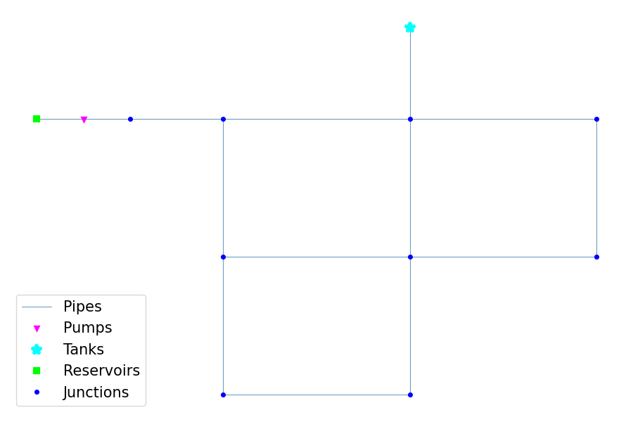

Usage
=====

Minimum Example:

.. code-block:: console
   
   >>> from epyt import epanet
   >>> d = epanet('Net1.inp')
   >>> d.getNodeCount()
   >>> d.getNodeElevations()

Plot the network

.. code-block:: console

   >>> d.plot()

Lists all available functions and properties

.. code-block:: console

   >>> dir(d)

Retrieve some examples for the function

.. code-block:: console

   >>> help(d.getNodeElevations)

**How to fix/report bugs**

To fix a bug Fork the EPyT, Edit the code and make the appropriate change, and then Pull it so that we evaluate it.

Keep in mind that some bugs may exist in the EPANET libraries, in case you are not receiving the expected results.

