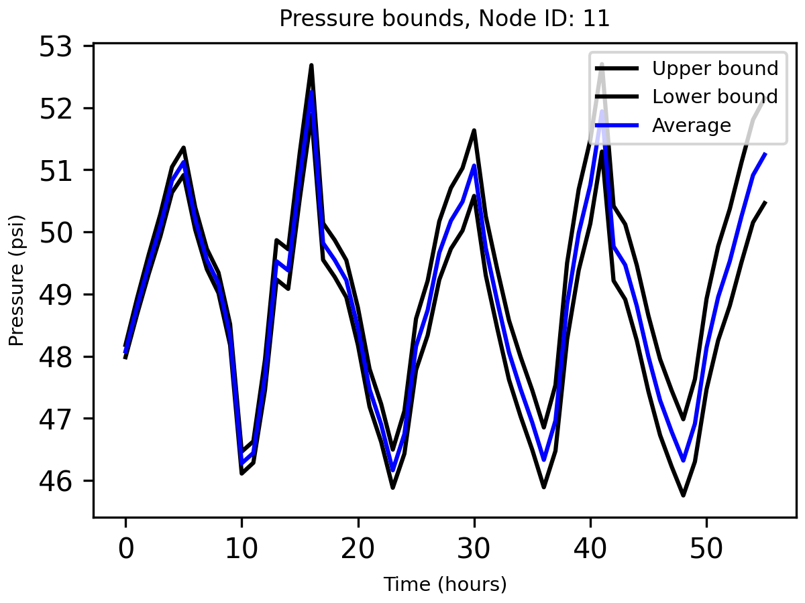
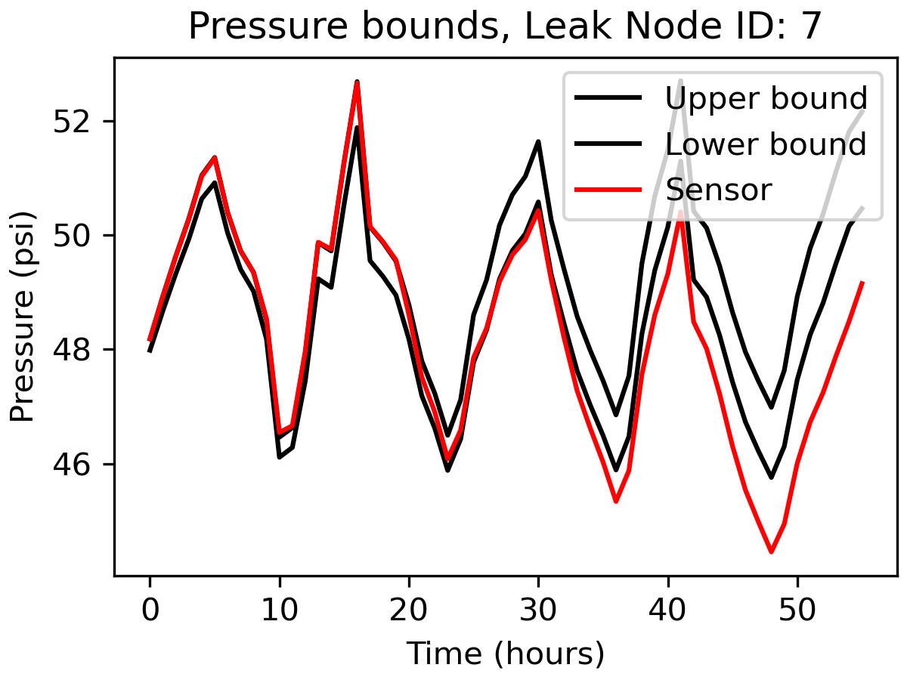
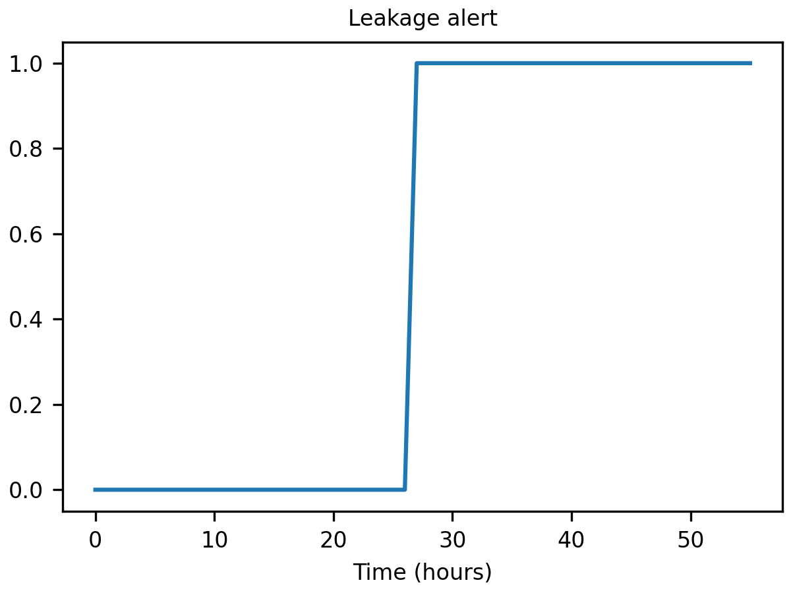

# Summary
This paper introduces EPyT, an open-source Python package for providing a Python-based programming interface for researchers and engineers with an open-source hydraulic and quality modelling software created by the US EPA, EPANET. EPyT extends the standard capabilities of the EPANET library, through the addition of new methods for advanced EPANET users. The data structure used in EPyT is similar to the data structure used in the EPANET-MATLAB Toolkit, which was previously developed by the authors to support academic research and education. In addition to the extensive Application Programming Interface, EPyT is accompanied by a collection of water distribution benchmarks and more than 25 code examples that the researchers can use as a starting point.  
# Statement of need 
To study some of the key challenges in smart water systems, such as water loss, water quality, energy efficiency, cybersecurity and emergency management, researchers need to be able to model and compute the drinking water system dynamics under various conditions. The open-source EPANET library, a simulation engine for computing hydraulic and water quality dynamics developed by the US EPA [@rossman2000] and supported by the “Open Water Analytics” community  [@salomons2018], is widely used by researchers and practitioners in the field, mainly through its desktop interface or through its integration to commercial software. 

For more advanced simulation capabilities, researchers design programs which make calls to the EPANET library, directly through programming languages and computing environments such as Python, R, C/C++, C#, MATLAB and Visual Basic [@eliades2016]. The Application Programming Interface (API) of EPANET supports extensive parameterization, however, it requires a high level of expertise. Alternatively, researchers can use "wrapper" functions which provide a basic API for communicating with the library. Recently, the concept of plug-ins has started to evolve, further extending the capabilities of the wrappers towards more specific research challenges [@sela2019].

## What problems the software is designed to solve
Both methods (direct calls and wrappers) are limited to the functions made available in the library and typically require a sufficient level of expertise in managing different data types and structures. Specifically, the fact that different researchers developed different data structures implies that sharing and reusing open-source code and releasing reproducible code using a standardized framework is not easy.
With the increasing popularity of Python in both industry and academia, a comprehensive toolkit was missing to support a wide area of applications in smart water network research. This paper introduces the `EPANET-Python Toolkit` (EPyT), for performing advanced simulations,  and other types of analysis, of drinking water distribution systems. Specifically, this software aims to solve the following problems:

1.	Provide a standardized framework for researchers in Smart Water Networks to implement their scientific findings.
2.	Reduce the time and effort needed to establish a connection with the EPANET libraries.
3.	Provide code templates to support the adoption of open science and reproducible research best practices.
5.	Provide a similar data structure in Python and MATLAB, to facilitate translation between the two environments.
## Target audience
The target audience is undergraduate and postgraduate students as well as researchers in the areas of civil, chemical, environmental, mechanical and electrical engineering, as well as computer science, who study smart drinking water distribution networks. Moreover, the toolkit can be used by researchers, data scientists and engineers working in startups and companies for the development of new innovative smart water solutions.
## State of the field
As a precursor of EPyt, the open-source `EPANET-MATLAB Toolkit` (EMT) was released in 2009, and since then it has been extended significantly and is continuously supported by the authors [@eliades2016]. Its purpose is to serve the needs of the smart water researchers and water engineering education community. EMT provides extensive functionalities beyond the EPANET capabilities, to support the design and evaluation of advanced methodologies. It is currently made available under the OpenWaterAnalytics Community (https://github.com/OpenWaterAnalytics/EPANET-Matlab-Toolkit). Moreover, EMT introduced the `epanet` class, which provided standardized data structures and function names which are human-readable and self-explanatory. Besides EPyT, a few other relevant Python-based tools connect with EPANET. The most advanced, and relevant to EPyT, is `WNTR` (Water Network Tool for Resilience), which was developed by the US EPA and Sandia National Laboratories and is released under the Revised BSD license (https://github.com/USEPA/WNTR) [@klise2017]. `WNTR` can facilitate the simulation of both hydraulic and quality dynamics, and in addition, it allows the simulation of various events such as pipe breaks, disasters such as earthquakes, power outages, fires, and contamination events. At the moment, `WNTR` includes only a subset of EPANET functions necessary for its simulation capabilities. `OOPNET` (Object-Oriented Pipe Network Analyzer) is a Python package that allows modelling and simulating hydraulic water distribution systems (https://github.com/oopnet/oopnet) [@steffelbauer2015]. A drawback is that, since `OOPNET` is based on the runtime executable of EPANET, it does not give currently provide access to the internal library functions. The `OWA-EPANET` is a SWIG auto-generated "thin" wrapper around the OWA EPANET (https://pypi.org/project/owa-epanet/). The goal of this package was to provide a Python interface that requires minimal effort to keep up to date with the core library and can be used by higher-level applications. Other Python-based EPANET toolkits include `epynet`, developed by Vitens (https://github.com/Vitens/epynet) and `epanettools` which supports older versions of the EPANET toolkit (https://pypi.org/project/EPANETTOOLS/). Recently a new tool has been published, `viswaternet` which provides a tool for visualizing static and time-varying attributes of EPANET-based water distribution systems; this tool can be used in parallel with EPyT for visualization purposes [@thomas2023].

A key unique feature of EPyT, is that it captures the complete function and parameter space of EPANET. Another important aspect of EPyT is that it shares the same function names as the EPANET-MATLAB Toolkit. Our motivation is that this will facilitate the transition of state-of-the-art code originating from academia (which typically uses MATLAB) to more industrial applications (which typically use Python due to its open-source license and its extended set of data analytics modules). 
# Basic usage of EPyT
The EPyT python class, `epanet`, includes properties of the input network model, static properties, public functions, and local functions that directly call the EPANET shared object library or the executable. The full API with detailed examples is provided in the link: https://epanet-python-toolkit-epyt.readthedocs.io/en/dev/api.html. In the following paragraphs, we will introduce a selection of the capabilities of the tool and an illustrative smart water research example.

Through EPyT, users can easily load EPANET network models, as demonstrated by importing the module and loading the `L-TOWN.inp` network in a provided example.

```python
from epyt import epanet   # Import the module "epanet" from the package "epyt"  
G = epanet('L-TOWN.inp')  # Load the L-Town epanet input file and create the object G
```
In this example, `G` is an `epanet` object which can be defined mathematically as the set comprised of the network graph topology (such as nodes and links), structural parameters (such as pipe lengths, diameters etc.) and functions (such as hydraulic solvers, etc.). `G` can also be shared between different functions as an argument. 

When the object is constructed, the module reads the EPANET input network file and populates more than 500 object parameters. To view some of the parameters and receive assistance with respect to the methods, the user can use the following commands:

```python
dir(G)  					# Lists all available functions and properties in G
help(G.getNodeElevations)  	# Retrieve some examples for the function getNodeElevations
```
Using object `G`, the user can call all the public toolkit functions. The toolkit contains a set of many functions which allow the user to retrieve or update the network data and simulate hydraulic and quality analysis for different scenarios using the EPANET libraries. Examples of how to retrieve some common network parameter values are provided below:
```python
diameters = G.getLinkDiameter()  	# retrieve Link diameters
elevations = G.getNodeElevations()  # retrieve Node elevations
```
The outputs for these are two arrays of size 909 and 785 respectively, which corresponds to the number of links and the number of nodes in the `L-Town` network. Note that, in case the network model changes, these parameters will be updated. This is demonstrated in the following example:

```python
G.getLinkDiameter([2, 10])  # Link diameter for link indices 2 & 10
G.setLinkDiameter(10, 90)  	# Change the link with index 10 diameter to 90mm
G.getLinkDiameter([2, 10])  # Retrieve the diameter of link index 10
```
In the next step, we show how to simulate the water distribution network, such as flows/pressures and water quality. Various functions have been included to simplify the workflows of solving and retrieving the data like. One way is to solve the hydraulics and quality equations using the EPANET library and store the results in data structures `H` and `Q`.

```python
H = G.getComputedHydraulicTimeSeries() 	# Solve hydraulics in library
Q = G.getComputedQualityTimeSeries()  	# Solve quality dynamics in library
```
To access the different values, the user can use the dot notation, such as `H.Head` to create an array with the hydraulic heads and `Q.NodeQuality` for the water quality at the nodes. It is important to note that the time intervals may be different for the hydraulic and quality time series, due to the simulation settings; the user can call `H.Time` and `Q.Time` respectively, to retrieve the time in seconds.

Executing the function `G.plot()` displays a figure of the network along with its components. The nodes i.e., junctions, reservoirs, tanks, and the links, i.e., pipes, valves, and pumps, are depicted using different colors and shapes. 

{ width=50% }

Moreover, when computing the hydraulic and quality parameters, we can use the `plot_ts` function which plots the different time series. An example is provided below for link indices 1 and 5.

```python
## Plot link flows
hrs_time = H.Time / 3600 					# transform seconds into hours
link_indices = [1, 5]						# select indices to plot
link_names = G.getLinkNameID(link_indices)	# get the ID of the link indices

G.plot_ts(X=hrs_time, Y=H.Flow[:, link_indices], title=f'Flow of links with ID: {link_names}', figure_size=[4, 3], legend_location='best', xlabel='Time (hrs)', ylabel=f'Flow ({G.units.LinkFlowUnits})', marker=None, labels=link_names, save_fig=True, filename='figures/paper_flows')
```

{ width=50% }

The user can unload the epanet dynamic library from Python memory, using the `G.unload()` method.
# An advanced EPyT example
A more advanced example is provided below, for designing a simple leakage detection algorithm for the `Net2` benchmark network. The goal is to generate bounds of pressure in order to be able to detect changes when these bounds are violated.

```python
inp_name = 'Net2.inp' 	# Select benchmark network Net2
G = epanet(inp_name)	# Create object G for Net2
```

Since we will be generating leakage events, it's useful to activate the Pressure Driven Analysis (PDA), instead of using the standard Demand Driven Analysis. 

```python
type = 'PDA'
pmin = 0 		# pressure below which demand is zero
preq = 0.1		# pressure required to deliver the full required demand
pexp = 0.5		# exponent of PDA function
G.setDemandModel(type, pmin, preq, pexp)  # Sets the demand model
```

We assume we have a pressure sensor at the node with ID "11". We will now create the pressure bounds at that node, using Monte Carlo Simulations. We assume that there is 2% uncertainty in the nominal base demands, with respect to the actual ones. 

```python
base_demands = G.getNodeBaseDemands()[1] 			# Get nominal base demands
sensor_node_id = '11'									
sensor_node_index = G.getNodeIndex(sensor_node_id)	# Get sensor node index
eta_bar = 0.02										# Specify maximum uncertainty 2%
```

We consider a suitable number of  Monte Carlo Simulations (we use 10the 0 here for computational convenience).

```python
nsim = 100			# Select number of simulations
np.random.seed(1) 	# Set seed number for reproducibility
pmcs = [None for _ in range(nsim)] # initialize pressure time series matrix 
# Compute pressures for each randomized scenario
for i in range(nsim):
	delta_bd = (2 * np.random.rand(1, len(base_demands))[0] - 1) * eta_bar * base_demands
	new_base_demands = base_demands + delta_bd 	# Compute new base demands
    G.setNodeBaseDemands(new_base_demands)		# Set base demands
    pmcs[i] = G.getComputedHydraulicTimeSeries().Pressure    # Compute pressures
    print(f"Epoch {i}")
```
The bounds can be computed using `numpy` methods, and the results are depicted in the following figure. Given a sufficient number of simulations, we expect that under normal conditions, pressure at node "11" will reside between those bounds. 



To demonstrate the detection ability of the proposed approach, we simulate a leakage with 50 gallons per minute (GPM) outflow at the node with ID "7", starting at time 20 hours.  

```python
## Add leakage at Node ID 7 after 20 hours
leak_start = 20		# leakage start time
leak_value = 50  	# leakage outflow (in GPM)
leak_node_id = '7'	# leakage location
leak_node_index = G.getNodeIndex(leak_node_id)

## Create a new leakage pattern
leak_pattern = np.zeros(max(G.getPatternLengths()))
leak_pattern[leak_start:] = 1
pattern_index = G.addPattern('leak', leak_pattern)
G.setNodeDemandPatternIndex(leak_node_index, pattern_index)
G.setNodeBaseDemands(leak_node_index, leak_value)

## Simulate pressure sensor measurement at node '7'
scada_pressures = G.getComputedHydraulicTimeSeries().Pressure
ps7 = scada_pressures[:, node_index-1] 		#  Sensor measurement at node "7"
```


The detection algorithm compares the lower pressure bound of node '7' with the actual pressure, as follows. The leakage alert flag is depicted in the next figure.

```python
e = ps7 - lb 	# compute the difference between the pressure sensor and the lower bound
alert = e < 0	# if the difference is less than 0, then raise a detection alrt
```



# Conclusions

In this paper, we have introduced the EPANET-Python Toolkit, an open-source software that provides a user-friendly and intuitive interface for Python with EPANET. This research toolkit was developed with the aim of facilitating the transition of MATLAB users to Python, while offering a similar set of functions. With the toolkit, users can access EPANET through both the shared object library and the executable, and it has a wide range of potential applications. The toolkit can serve as a framework for designing new monitoring, control, and fault/event diagnosis algorithms, as well as for formulating optimization problems based on water distribution network models. Additionally, the EPANET-Python Toolkit is released under an open-source license (EUPL), allowing for contributions, issue reporting, and suggestions for improvement in line with the best practices of the EPANET Open-Source Initiative. Future work will aim to expand the toolkit's capabilities to include the EPANET-MSX library, thus providing multi-species analysis for users.

# Acknowledgements

This work was co-funded by the European Research Council (ERC) under the ERC Synergy Grant Water-Futures (Grant agreement No. 951424), the European Regional Development Fund and the Republic of Cyprus through the Research and Innovation Foundation under the DigiWATER project (Grant agreement ENTERPRISES/0521/0081), and supported by the European Union Horizon 2020 programme and the Government of the Republic of Cyprus through the Deputy Ministry of Research, Innovation and Digital Policy under the KIOS CoE project (Grant agreement No. 739551).

# References


 
