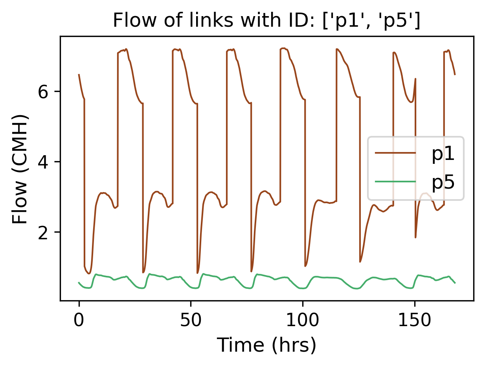

# Summary

This paper introduces EPyT, an open-source Python package for providing a Python-based programming interface with 
the open-source hydraulic and quality modeling software EPANET, created by the US Environmental Protection Agency. EPyT extends the standard capabilities of the EPANET library, through the addition of new methods for research purposes. In addition to the extensive Application Programming Interface, EPyT is accompanied by a collection of water distribution benchmarks and more than 25 code examples that researchers can use as a starting point.  

# Statement of need 

The modeling and simulation of drinking water systems under various conditions is crucial when studying the key 
challenges that smart water systems are facing, such as, detection and localization of leakages, monitoring and 
control of water quality, energy efficient operation, cybersecurity, and emergency management. The open-source 
EPANET library, a simulation engine of hydraulic and water quality dynamics developed by the US EPA [@rossman2000] 
and supported by the *OpenWaterAnalytics Community*  [@salomons2018], is widely used by researchers and practitioners in the field, mainly through its desktop interface or through its integration with commercial software. 

Researchers can design programs that make calls to the EPANET library, directly through programming languages and computing environments such as Python, R, C/C++, C#, MATLAB, and Visual Basic. The Application Programming Interface (API) of EPANET supports extensive parameterization, however, it requires a high level of expertise in software engineering (e.g., in coding, data structures, etc.). Alternatively, researchers can use "wrapper" functions, which provide a basic API for communicating with the library. Recently, the concept of plug-ins has started to evolve, further extending the capabilities of the wrappers toward more specific research challenges [@sela2019].

## Challenge

Both methods (direct calls and wrappers) are limited to the functions made available in the library and typically require a sufficient level of expertise in managing different data types and structures. Specifically, the fact that different researchers developed different data structures implies that sharing and reusing open-source code and releasing reproducible code using a standardized framework is not easy. With the increasing popularity of Python in both industry and academia, a comprehensive toolkit was missing to support a wide area of applications in Smart Water Network (SWN) research and development. This paper introduces the `EPANET-Python Toolkit` (EPyT), for performing research-related computations (e.g., simulations) and other types of analysis (e.g., graph theory), of drinking water distribution systems. Specifically, this software aims to solve the following problems:

1.	Provide a standardized framework for researchers working in the area of SWN to implement their scientific findings.
2.	Reduce the time and effort needed to establish a connection with the EPANET libraries.
3.	Provide code templates for expanding the capabilities of EPANET and facilitating smart water systems research, while supporting the adoption of open-science and reproducible research best practices.
4.	Provide a similar data structure in Python and MATLAB, to facilitate translation between the two environments.

## State of the field

As a precursor of EPyT, the open-source [EPANET-MATLAB Toolkit](https://github.com/OpenWaterAnalytics/EPANET-Matlab-Toolkit) (EMT) was released in 2009, and is continuously supported by the 
authors [@eliades2016]. As a result of serving the needs of smart water researchers and the water engineering 
education community, it has been extended significantly. EMT provides extensive functionalities beyond the EPANET 
capabilities, to support the design and evaluation of research methodologies. It is currently made available under 
the *OpenWaterAnalytics Community*. Moreover, EMT introduced the `epanet` class, which provides standardized data 
structures and function names which are human-readable and self-explanatory. In addition to EPyT, a few other 
relevant Python-based tools connect with EPANET. The most advanced, and relevant, is the [Water Network Tool for Resilience](https://github.com/USEPA/WNTR)  (WNTR), which was developed by the US EPA and Sandia National Laboratories, and released under the Revised BSD license [@klise2017]. `WNTR` facilitates the simulation of both hydraulic and quality dynamics, and in addition, it allows the simulation of various events such as pipe breaks, disasters such as earthquakes, power outages, fires, and contamination events. At the moment, `WNTR` includes only a subset of EPANET functions necessary for its simulation capabilities. The [Object-Oriented Pipe Network Analyzer](https://github.com/oopnet/oopnet) (OOPNET) is a Python package that allows modelling and simulating hydraulic water distribution systems  [@steffelbauer2015]. A drawback is that, since `OOPNET` is based on the runtime executable of EPANET, it does not provide access to the internal library functions. The [OWA-EPANET](https://pypi.org/project/owa-epanet/) is a SWIG auto-generated "thin" wrapper around the EPANET libraries. The goal of this package is to provide a Python interface that requires minimal effort to keep up to date with the core library and can be used by higher-level applications. Other Python-based EPANET toolkits include [epynet](https://github.com/Vitens/epynet), developed by Vitens, and [epanettools](https://pypi.org/project/EPANETTOOLS/) which supports older versions of the EPANET toolkit. Recently a new tool has been published, [viswaternet](https://pypi.org/project/viswaternet/) which provides a tool for visualizing static and time-varying attributes of EPANET-based water distribution systems; this tool can be used in parallel with EPyT for visualization purposes [@thomas2023].

A key unique feature of EPyT, is that it captures the complete function and parameter space of EPANET. Another important aspect of EPyT is that it shares the same function names as the EPANET-MATLAB Toolkit. Our motivation is that this will facilitate the transition of state-of-the-art code originating from research and academia (which typically uses MATLAB) to more industrial applications, which typically use Python due to its open-source license and its extended set of data analytics modules. 

# Functionality
The EPyT python class, `epanet`, includes properties of the input network model, static properties, public 
functions, and local functions that directly call the EPANET shared object library or the executable. The full API with detailed examples is provided in the [link](https://epanet-python-toolkit-epyt.readthedocs.io/en/latest/api.html). In the following paragraphs, we introduce a selection of the capabilities of the tool and an illustrative smart water research example.

Through EPyT, users can easily load EPANET network models, as demonstrated by importing the module and loading the 
`L-TOWN.inp` network in a provided example [@vrachimis2022].

```python
from epyt import epanet   # Import the module "epanet" from the package "epyt"  
G = epanet('L-TOWN.inp')  # Load the L-Town input file and create the object G
```
In this example, `G` is an `epanet` object which can be defined mathematically as the set comprised of the network graph topology (such as nodes and links), structural parameters (such as pipe lengths, diameters, etc.), and functions (such as hydraulic solvers, etc.). `G` can also be shared between different functions as an argument. 

When the object is constructed, the module reads the EPANET input network file and populates more than 500 object parameters. To view some of the parameters and receive assistance with respect to the methods, the user can use the following commands:

```python
dir(G)  					# Lists all available functions and properties in G
help(G.getNodeElevations)  	# Retrieve usage examples for getNodeElevations
```
Using object `G`, the user can call all the public toolkit functions. The toolkit contains a large set of functions that allow the user to retrieve or update the network data and simulate hydraulic and quality analysis for different scenarios using the EPANET libraries. Examples of how to retrieve some common network parameter values are provided below:
```python
diameters = G.getLinkDiameter()  	# retrieve Link diameters
elevations = G.getNodeElevations()  # retrieve Node elevations
```
Variables `diameters` and `elevations` are two arrays of size 909 and 785 respectively, corresponding to the number of links, and the number of nodes in the `L-Town` network, respectively. Note that, in case the network model changes, these parameters will be updated. This is demonstrated in the following example:

```python
G.getLinkDiameter([2, 10])  # Link diameter for link indices 2 & 10
G.setLinkDiameter(10, 90)  	# Change the link with index 10 diameter to 90mm
G.getLinkDiameter([2, 10])  # Retrieve the diameter of link index 10
```
Next, we show how to simulate the water distribution network, such as flows/pressures and water quality. Various functions have been included in the toolkit to simplify the workflows of solving and retrieving the data from the library memory. One way is to solve the hydraulics and quality equations using the EPANET library and store the results in data structures `H` and `Q`.

```python
H = G.getComputedHydraulicTimeSeries() 	# Solve hydraulics in library
Q = G.getComputedQualityTimeSeries()  	# Solve quality dynamics in library
```
To access the different values, the user can use the dot notation, such as `H.Head` to create an array with the hydraulic heads and `Q.NodeQuality` for the water quality at the nodes. It is important to note that the time intervals may be different for the hydraulic and quality time series, due to the simulation settings; the user can call `H.Time` and `Q.Time` respectively, to retrieve the time in seconds.

Executing the function `G.plot()` displays a figure of the network along with its components. The nodes i.e., junctions, reservoirs, tanks, and the links, i.e., pipes, valves, and pumps, are depicted using different colors and shapes. 

{ width=75% }

Moreover, when computing the hydraulic and quality parameters, we can use the `plot_ts` function which plots the different time series. An example is provided below for link indices 1 and 5.

```python
## Plot link flows
hrs_time = H.Time / 3600 					# transform seconds into hours
link_indices = [1, 5]						# select indices to plot
link_names = G.getLinkNameID(link_indices)	# get the ID of the link indices

G.plot_ts(X=hrs_time, 
          Y=R.Flow[:, link_indices], 
          title=f'Flow of links with ID: {link_names}',
          figure_size=[4, 3],
          legend_location='best', 
          xlabel='Time (hrs)', 
          ylabel=f'Flow ($m^3$/hour)', 
          marker=None, 
          color=['r', 'g'],
          fontsize=8,
          fontsize_title=8,
          labels=link_names, 
          save_fig=True, 
          filename='figures/paper_flows')

```

{ width=75% }

The user can unload the EPANET dynamic library from Python memory, using the `G.unload()` method.

Illustrative examples, as well as use cases on how to use EPyT, are provided in the [EPyT Documentation](https://epanet-python-toolkit-epyt.readthedocs.io/).

# Conclusions

In this paper, we have introduced the EPANET-Python Toolkit, an open-source software that provides a user-friendly 
and intuitive interface for Python with EPANET. This research toolkit was developed with the aim of facilitating the 
transition of MATLAB users to Python, while offering a similar set of functions. With the EPyT toolkit, users can 
access EPANET through both the shared object library and the binary file. The toolkit can serve as a framework for 
designing new monitoring, control, and fault/event diagnosis algorithms, as well as for formulating optimization problems based on water distribution network models. Additionally, the EPANET-Python Toolkit is released under an open-source license (EUPL), allowing for contributions, issue reporting, and suggestions for improvement, in line with the best practices of the EPANET Open-Source Initiative. Future work will aim to expand the toolkit's capabilities to include the EPANET-MSX library, thus providing multi-species water quality analysis for users.

# Acknowledgments

This work was co-funded by the European Research Council (ERC) under the ERC Synergy Grant Water-Futures (Grant agreement No. 951424), the European Regional Development Fund, and the Republic of Cyprus through the Research and Innovation Foundation under the DigiWATER project (Grant agreement ENTERPRISES/0521/0081), and supported by the European Union Horizon 2020 programme and the Government of the Republic of Cyprus through the Deputy Ministry of Research, Innovation and Digital Policy under the KIOS CoE project (Grant agreement No. 739551).

# References
